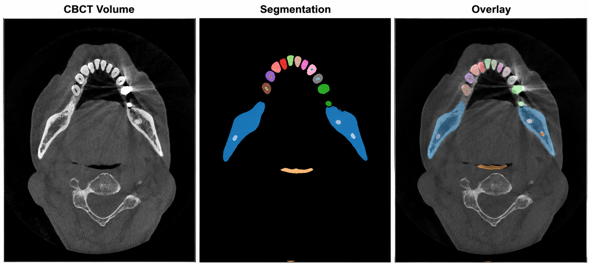
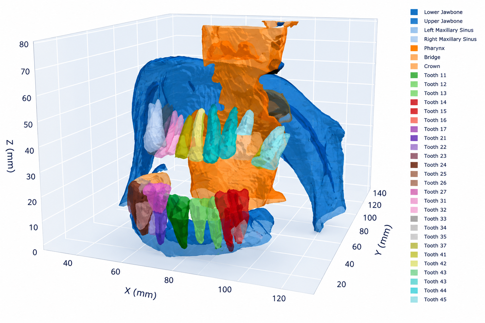

# Dental CBCT Segmentation Pipeline using nnU-Net v2

<!-- Badges -->


> End-to-end 3D dental CBCT segmentation pipeline using nnU-Net v2 on the ToothFairy3 dataset with 532 CBCT volumes and 77 anatomical classes.

<p align="center">
  
</p>

---

## Overview

Cone-Beam Computed Tomography (CBCT) is the standard 3D imaging modality in modern dentistry, producing volumetric scans of the craniofacial region. Accurate automated segmentation of dental structures from CBCT volumes is critical for treatment planning (implant placement, orthodontics, oral surgery), 3D reconstruction, and computer-aided diagnosis.

This repository implements a **complete, reproducible segmentation pipeline** for 77 dental and maxillofacial classes — including individual teeth, jawbones, dental restorations (crowns, bridges, implants), pulp chambers, root canals, maxillary sinuses, and the inferior alveolar canal (IAC). The pipeline is built on [nnU-Net v2](https://github.com/MIC-DKFZ/nnUNet), the self-configuring framework that has achieved state-of-the-art results across 23+ medical image segmentation benchmarks.

### Key Features

- **77-class multi-label segmentation** of dental CBCT volumes (FDI notation teeth, anatomical structures, restorations)
- **Self-configuring pipeline** via nnU-Net v2 — automatic fingerprinting, preprocessing, architecture search, and training
- **Modular Python package** (`dental_pipeline`) with clean separation of concerns
- **YAML-driven configuration** — single config file controls the entire pipeline
- **Dataset validation** — structural, format, and label integrity checks before training
- **Post-processing** — connected component analysis and minimum-size filtering for anatomically plausible predictions
- **Comprehensive evaluation** — per-class Dice, HD95, sensitivity, precision, and category-aggregated metrics
- **Interactive visualization** — multi-slice overlays with Plotly for qualitative assessment
- **Read-only dataset handling** — symlinks preserve original data; all outputs go to separate directories
- **Reproducibility** — fixed seeds, deterministic training, full logging

---

## Repository Structure

```
dental-cbct-segmentation-pipeline/
│
├── README.md                          # This file
├── Report.pdf                         # Technical report
├── requirements.txt                   # Python dependencies
├── setup.py                           # Package installation
│
├── configs/
│   └── pipeline_config.yaml           # Central YAML configuration
│
├── src/
│   └── dental_pipeline/
│       ├── __init__.py                # Package init + version
│       ├── config.py                  # Configuration dataclass + loader
│       ├── dataset_validator.py       # Dataset structure & label validation
│       ├── label_remapping.py         # nnU-Net label ID remapping
│       ├── nnunet_setup.py            # nnU-Net directory setup + dataset.json
│       ├── postprocessing.py          # Connected-component post-processing
│       ├── metrics.py                 # Dice, HD95, per-class evaluation
│       └── visualization.py          # Plotly-based volume visualization
│
├── scripts/
│   ├── 01_validate_dataset.py         # Step 1: Validate ToothFairy3 dataset
│   ├── 02_setup_nnunet.py             # Step 2: Create nnU-Net directory structure
│   ├── 03_preprocess.py               # Step 3: Run nnU-Net preprocessing
│   ├── 04_train.py                    # Step 4: Launch nnU-Net training
│   ├── 05_evaluate.py                 # Step 5: Predict + compute metrics
│   └── 06_visualize.py               # Step 6: Generate visualizations
│
├── assets/
│   └── images/                        # Project visualizations for README
│
└── outputs/                           # All pipeline outputs
    ├── label_mapping.json             # Label ID mapping (original to contiguous)
    ├── nnunet_env.sh                  # nnU-Net environment variable exports
    ├── validation_report/             # Dataset validation results
    ├── nnunet_results/                # Trained model checkpoints
    ├── predictions/                   # Inference outputs
    ├── metrics/                       # Evaluation CSVs + visualizations
    ├── visualizations/                # Plotly HTML + PNG slices
    └── logs/                          # Pipeline execution logs
```

---

## Quick Start

```bash
# 1. Clone and navigate to the repository
git clone https://github.com/shreddedlines/dental-cbct-segmentation-pipeline.git
cd dental-cbct-segmentation-pipeline

# 2. Create environment and install
conda create -n dental python=3.10 -y
conda activate dental
pip install -e ".[dev]"

# 3. Configure — set your dataset path
#    Edit configs/pipeline_config.yaml:
#      paths.dataset_root: "/path/to/ToothFairy3"

# 4. Validate the dataset
python scripts/01_validate_dataset.py

# 5. Setup, preprocess, and train
python scripts/02_setup_nnunet.py
python scripts/03_preprocess.py
python scripts/04_train.py
```

---

## Detailed Setup

### System Requirements

| Component     | Minimum                  | Recommended              |
|---------------|--------------------------|--------------------------|
| **OS**        | Ubuntu 20.04 LTS         | Ubuntu 22.04 LTS         |
| **GPU**       | NVIDIA GPU, 12 GB VRAM   | NVIDIA RTX A5000, 24 GB  |
| **RAM**       | 32 GB                    | 64 GB                    |
| **Storage**   | 200 GB free              | 500 GB SSD               |
| **CUDA**      | 11.8                     | 12.1                     |
| **Python**    | 3.10                     | 3.10                     |

### Python Environment

```bash
# Create a fresh conda environment
conda create -n dental python=3.10 -y
conda activate dental

# Install PyTorch with CUDA support
pip install torch torchvision torchaudio --index-url https://download.pytorch.org/whl/cu118

# Install the pipeline package in editable mode
pip install -e ".[dev]"

# Verify installation
python -c "import dental_pipeline; print(dental_pipeline.__version__)"
python -c "import torch; print(f'CUDA available: {torch.cuda.is_available()}')"
```

### nnU-Net v2 Setup

nnU-Net v2 is installed automatically as a dependency. The pipeline sets the required environment variables programmatically via `nnunet_setup.py`, but you can also export them manually:

```bash
export nnUNet_raw="$(pwd)/outputs/nnunet_raw"
export nnUNet_preprocessed="$(pwd)/outputs/nnunet_preprocessed"
export nnUNet_results="$(pwd)/outputs/nnunet_results"
```

### Dataset Preparation

1. **Download** the ToothFairy3 dataset from the [official source](https://ditto.ing.unimore.it/toothfairy3/).
2. **Extract** the archive — do **not** modify the original data.
3. **Set the path** in `configs/pipeline_config.yaml`:
   ```yaml
   paths:
     dataset_root: "/path/to/ToothFairy3"
   ```
4. **Run validation** to confirm dataset integrity:
   ```bash
   python scripts/01_validate_dataset.py
   ```

The dataset should have the following structure:
```
ToothFairy3/
├── dataset.json
├── imagesTr/          # 532 CBCT volumes (.nii.gz)
└── labelsTr/          # 532 segmentation masks (.nii.gz)
```

---

## Usage

The pipeline consists of six sequential scripts. Each script loads configuration from `configs/pipeline_config.yaml` and writes outputs to the `outputs/` directory.

### Step 1: Validate Dataset

```bash
python scripts/01_validate_dataset.py
```

Checks dataset structure, verifies all volumes have corresponding labels, validates NIfTI headers (affine consistency, shape matching), and audits label IDs against the expected 77-class schema. Produces a JSON validation report in `outputs/validation_report/`.

### Step 2: Setup nnU-Net Directory Structure

```bash
python scripts/02_setup_nnunet.py
```

Creates the nnU-Net-compatible directory layout under `outputs/nnunet_raw/`, generates `dataset.json` with the full 77-class label mapping, and creates symlinks to the original dataset (preserving read-only access). Sets nnU-Net environment variables.

### Step 3: Preprocess

```bash
python scripts/03_preprocess.py
```

Invokes `nnUNetv2_plan_and_preprocess` to run dataset fingerprinting, compute target spacing, determine normalization statistics, and preprocess all volumes. This step is compute-intensive and may take several hours.

### Step 4: Train

```bash
python scripts/04_train.py
```

Launches `nnUNetv2_train` for the configured fold(s) and configuration (default: `3d_fullres`, fold 0). Training runs for 1000 epochs with SGD + polynomial LR decay, Dice + Cross-Entropy loss, and deep supervision. Checkpoints are saved to `outputs/nnunet_results/`.

To resume interrupted training:
```yaml
# In pipeline_config.yaml:
training:
  continue_training: true
```

### Step 5: Evaluate

```bash
python scripts/05_evaluate.py
```

Runs `nnUNetv2_predict` on the validation set, applies post-processing (connected component analysis), and computes per-class Dice, HD95, sensitivity, and precision. Results are saved as CSVs and visualizations in `outputs/metrics/`.

### Step 6: Visualize

```bash
python scripts/06_visualize.py
```

Generates interactive Plotly HTML visualizations with axial/coronal/sagittal slice overlays for qualitative inspection. Outputs are saved to `outputs/visualizations/`.

---

## Pipeline Overview

```
┌─────────────────────────────────────────────────────────────────────────┐
│                    Dental CBCT Segmentation Pipeline                    │
└─────────────────────────────────────────────────────────────────────────┘

  ToothFairy3 Dataset (532 CBCT volumes, 77 classes)
         │
         ▼
  ┌──────────────┐     Structural checks, NIfTI validation,
  │  01 Validate  │───▶ label audit → validation_report.json
  └──────┬───────┘
         │
         ▼
  ┌──────────────┐     Symlinks, dataset.json generation,
  │  02 Setup     │───▶ nnU-Net env variables
  └──────┬───────┘
         │
         ▼
  ┌──────────────┐     Fingerprinting, resampling,
  │  03 Preprocess│───▶ normalization, cropping
  └──────┬───────┘
         │
         ▼
  ┌──────────────┐     3D U-Net, 1000 epochs, SGD,
  │  04 Train     │───▶ Dice+CE loss, deep supervision
  └──────┬───────┘
         │
         ▼
  ┌──────────────┐     Inference, connected components,
  │  05 Evaluate  │───▶ per-class Dice & HD95
  └──────┬───────┘
         │
         ▼
  ┌──────────────┐     Axial/coronal/sagittal overlays,
  │  06 Visualize │───▶ interactive Plotly HTML
  └──────────────┘
```

---

## Sample Results

### Qualitative Overlay

<p align="center">
  
</p>

<p align="center"><em>Example axial CBCT slice showing the original scan, predicted segmentation mask, and overlay visualization.</em></p>

### Interactive 3D Segmentation

<p align="center">
  
</p>

<p align="center"><em>Interactive Plotly-based 3D visualization of segmented anatomical structures generated from the predicted segmentation.</em></p>

---

## Configuration Reference

All pipeline behavior is controlled by `configs/pipeline_config.yaml`. Key sections:

| Section           | Key                        | Description                                    | Default              |
|-------------------|----------------------------|------------------------------------------------|----------------------|
| `project`         | `name`                     | Project identifier                             | `dental-cbct-segmentation` |
| `project`         | `seed`                     | Global random seed                             | `42`                 |
| `paths`           | `dataset_root`             | Path to ToothFairy3 dataset                    | *(must set)*         |
| `paths`           | `output_root`              | Root for all outputs                           | `./outputs`          |
| `dataset`         | `id`                       | nnU-Net dataset ID                             | `100`                |
| `dataset`         | `num_classes`              | Number of segmentation classes                 | `77`                 |
| `nnunet`          | `configuration`            | nnU-Net config (`3d_fullres` / `3d_lowres`)    | `3d_fullres`         |
| `nnunet`          | `trainer`                  | nnU-Net trainer class                          | `nnUNetTrainer`      |
| `nnunet`          | `folds`                    | Training folds                                 | `[0]`                |
| `nnunet`          | `num_processes`            | Preprocessing workers                          | `8`                  |
| `training`        | `epochs`                   | Number of training epochs                      | `1000`               |
| `evaluation`      | `postprocessing`           | Post-processing parameters                     | See config file      |
| `visualization`   | `num_cases`                | Cases to visualize                             | `3`                  |

See [`configs/pipeline_config.yaml`](configs/pipeline_config.yaml) for the complete configuration with inline comments.

---

## Results

### Segmentation Performance (Fold 0)

| Category           | Structures                          | Mean Dice | HD95 (mm) | Sensitivity | Precision |
|--------------------|-------------------------------------|-----------|-----------|-------------|-----------|
| **Anatomical**     | Jawbones, IAC, Sinuses, Pharynx     | 0.7247    | 27.80     | 0.7865      | 0.7521    |
| **Teeth**          | 32 teeth (FDI 11–48)                | 0.6904    | 9.60      | 0.8284      | 0.7301    |
| **Pulps**          | 32 pulp chambers                    | 0.6210    | 6.32      | 0.6599      | 0.7444    |
| **Restorations**   | Crown, Bridge, Implant              | 0.4894    | 8.46      | 0.6494      | 0.6036    |
| **Canals**         | Mandibular Incisive, Lingual        | 0.4174    | 14.50     | 0.4477      | 0.5488    |
| **Overall**        | All 77 classes                      | 0.6489    | 10.65     | 0.7335      | 0.7261    |

Detailed per-class results are available in `outputs/metrics/fold_0/`.

### Qualitative Results

See [Sample Results](#sample-results) for visual examples. Additional interactive visualizations are available in `outputs/visualizations/`.

---

## Troubleshooting

### Common Issues

| Issue | Cause | Solution |
|-------|-------|----------|
| `CUDA out of memory` | Batch/patch size too large for GPU | nnU-Net auto-configures; if OOM persists, try `3d_lowres` configuration |
| `FileNotFoundError: dataset_root` | Dataset path not set | Edit `dataset_root` in `configs/pipeline_config.yaml` |
| `nnUNet environment variables not set` | Skipped Step 2 | Run `python scripts/02_setup_nnunet.py` or export variables manually |
| `No labels found for case X` | Missing label file | Re-download dataset; run `01_validate_dataset.py` to identify gaps |
| `Shape mismatch` between image and label | Corrupted NIfTI | Validation script will flag these; exclude or re-download |
| `ImportError: dental_pipeline` | Package not installed | Run `pip install -e .` from repo root |
| `Permission denied` on dataset | Read-only filesystem | Pipeline uses symlinks; ensure `outputs/` is writable |

### Performance Tips

- **Storage**: Use SSD for `nnunet_preprocessed/` — preprocessing I/O is the bottleneck.
- **Multi-fold training**: Train folds in parallel on separate GPUs with `CUDA_VISIBLE_DEVICES`.
- **Monitoring**: Use `nvidia-smi -l 5` and check logs in `outputs/logs/` during training.

---

## References

- **nnU-Net v2**: Isensee, F., et al. "nnU-Net: a self-configuring method for deep learning-based biomedical image segmentation." *Nature Methods* 18.2 (2021): 203-211.
- **ToothFairy3**: Cipriano, M., et al. ToothFairy3 Challenge Dataset. [https://ditto.ing.unimore.it/toothfairy3/](https://ditto.ing.unimore.it/toothfairy3/)
- **3D U-Net**: Çiçek, Ö., et al. "3D U-Net: learning dense volumetric segmentation from sparse annotation." *MICCAI* 2016.

---

The ToothFairy3 dataset is licensed under [CC BY-SA 4.0](https://creativecommons.org/licenses/by-sa/4.0/).
