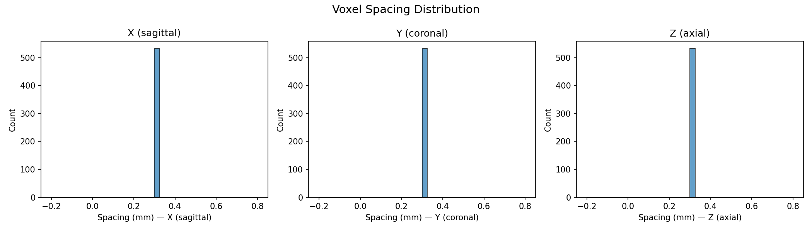
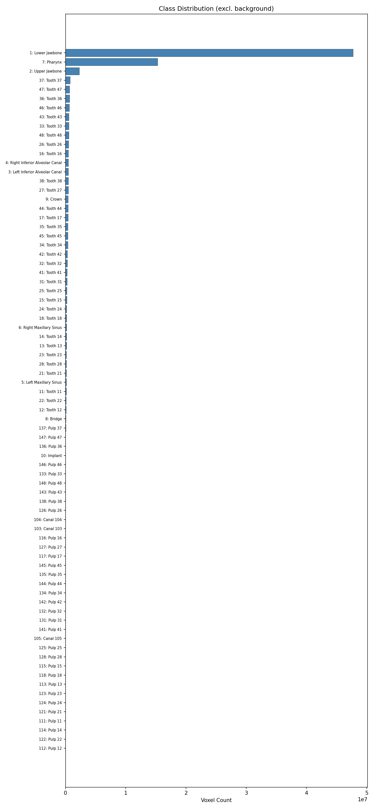

# Dataset Validation Report

**Dataset root:** `/usershome/cs671_user15/Dobbe AI/ToothFairy3`

**Total validation time:** 16.3 s

## Summary

| Check | Status |
|-------|--------|
| File Pairing | ❌ FAIL |
| Shape / Affine Match | ✅ PASS |
| Label Value Validity | ✅ PASS |
| NaN / Inf Check | ✅ PASS |

## File Pairing

- Images found: **532**
- Labels found: **481**
- Paired:       **480**
- ⚠️ Images without labels: ['ToothFairy3S_0000', 'ToothFairy3S_0001', 'ToothFairy3S_0002', 'ToothFairy3S_0003', 'ToothFairy3S_0004', 'ToothFairy3S_0005', 'ToothFairy3S_0006', 'ToothFairy3S_0007', 'ToothFairy3S_0008', 'ToothFairy3S_0009']
- ⚠️ Labels without images: ['ToothFairy3S']

## Shape & Affine Validation

- Cases checked: **30**
- Mismatches: **0**

## Voxel Spacing

- Volumes analysed: **532**
- Unique spacing combos: **1**
- Mean spacing: `['0.3000', '0.3000', '0.3000']`
- Min  spacing: `['0.3000', '0.3000', '0.3000']`
- Max  spacing: `['0.3000', '0.3000', '0.3000']`

## Intensity Statistics

- Sample size: **10**
- Global min: **-1000.0**
- Global max: **4091.0**
- Mean of means: **-89.7**

## Class Distribution

- Sample size: **30** volumes

| Label ID | Name | Voxel Count |
|----------|------|-------------|
| 0 | background | 723,863,817 |
| 1 | Lower Jawbone | 47,732,365 |
| 7 | Pharynx | 15,282,491 |
| 2 | Upper Jawbone | 2,284,525 |
| 37 | Tooth 37 | 744,822 |
| 47 | Tooth 47 | 668,859 |
| 36 | Tooth 36 | 658,571 |
| 46 | Tooth 46 | 615,938 |
| 43 | Tooth 43 | 556,947 |
| 33 | Tooth 33 | 545,856 |
| 48 | Tooth 48 | 543,691 |
| 26 | Tooth 26 | 513,553 |
| 16 | Tooth 16 | 482,896 |
| 4 | Right Inferior Alveolar Canal | 478,907 |
| 3 | Left Inferior Alveolar Canal | 459,360 |
| 38 | Tooth 38 | 458,379 |
| 27 | Tooth 27 | 458,110 |
| 9 | Crown | 431,446 |
| 44 | Tooth 44 | 427,159 |
| 17 | Tooth 17 | 415,194 |
| 35 | Tooth 35 | 405,832 |
| 45 | Tooth 45 | 404,762 |
| 34 | Tooth 34 | 377,257 |
| 42 | Tooth 42 | 308,787 |
| 32 | Tooth 32 | 298,763 |
| 41 | Tooth 41 | 253,521 |
| 31 | Tooth 31 | 246,469 |
| 25 | Tooth 25 | 220,380 |
| 15 | Tooth 15 | 210,619 |
| 24 | Tooth 24 | 186,495 |
| 18 | Tooth 18 | 178,599 |
| 6 | Right Maxillary Sinus | 176,491 |
| 14 | Tooth 14 | 175,529 |
| 13 | Tooth 13 | 164,183 |
| 23 | Tooth 23 | 157,867 |
| 28 | Tooth 28 | 154,901 |
| 21 | Tooth 21 | 146,530 |
| 5 | Left Maxillary Sinus | 146,483 |
| 11 | Tooth 11 | 142,168 |
| 22 | Tooth 22 | 89,996 |
| … | *(38 more)* | … |

## Field-of-View Breakdown

- Total volumes: **532**

| Prefix | Count |
|--------|-------|

- Unclassified: 532 volumes

## Label Validity

- Volumes checked: **30**
- Invalid volumes: **0**

## NaN / Inf Check

- Volumes checked: **10**
- ✅ No corrupt values detected.
